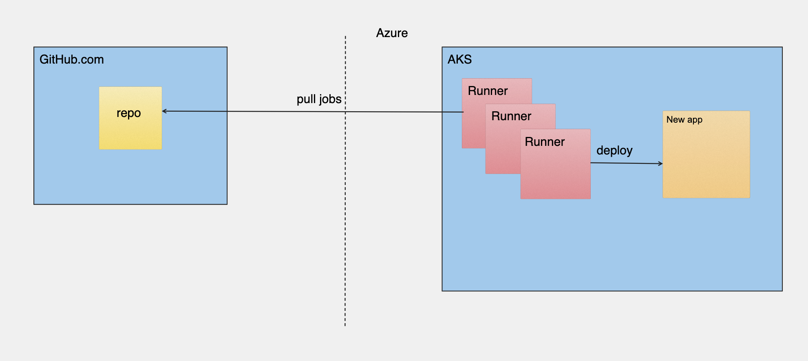

# Self-Hosted GitHub Actions Runner On AKS (Azure Kubernetes Service) with auto-scale option

This repo will demo shortly how you can connect to your github account a self-hosted runner which deployed on Azure Kubernetes Service (AKS) with auto-scale option - which provide an ability to handle successfully many github action job requests in parallel.
This project include the following: 
- Bicep deployment, which responsible to following tasks:
  - AKS deployment
  - Install [GitHub Actions Runner Controller (ARC)](https://github.com/actions-runner-controller/actions-runner-controller/blob/master/docs/detailed-docs.md) on AKS with auto-scale configuration
- Deploying sample app using the installed self-hosted runner to AKS cluster without keeping Azure password in Github account

## Simple Diagram of End State
After deployment, the outcome will be:


## Features

This project framework provides the following features:

* Self-Hosted GitHub Actions Runner over AKS
* Auto-Scale Github Action runner based on 'waiting number of jobs in the queue' metric

## Getting Started

### Prerequisites

- Fork this repo to your github account
- In the forked repo [Configure OpenID Connect in Azure](https://learn.microsoft.com/en-us/azure/developer/github/connect-from-azure?tabs=azure-portal%2Clinux). After completing the instructions, the following secrets should be created in your repo secrets: AZURE_CLIENT_ID, AZURE_SUBSCRIPTION_ID, AZURE_TENANT_ID
- Create additional GitHub Secrets in the repo: 
  - name: SSH_PUBLIC_KEY, value: [public key of ssh key which will be used during AKS creation]
  - name: RUNNER_TOKEN, value: Create a new personal access token by login with a GitHub account that has admin privileges for your repo, and [create a PAT](https://github.com/settings/tokens/new) with the appropriate scopes - for this sample:
  -  repo (Full Control)
  -  write:packages

### Installation

Follow this instructions:

- Execute the Github Action - [Build and Publish a runner image to ghcr](.github/workflows/buildImage.yaml)
- Go to [actions-runner-controller](runner/actions-runner-controller.yaml), replace ```ghcr.io/yaronpri/githubrunneronaks:main``` with the full image name from previous step, this step is necessary in order to use a GitHub runner image with Azure CLI and kubectl as part of the image
- Go to [hra-scaler](runner/hra-scaler.yaml), replace `GithubRunnerOnAKS` with your repository name
- Execute the GitHub Action - [IaC deployment](.github/workflows/deployIaC.yaml)

#### Using images from private registry

When using private images, the `RunnerDeployment` will not be able to pull your image.  
To use a private registry (e.g ghcr.io with visibility set to private) add the following:

- Go to [IaC deployment](.github/workflows/deployIaC.yaml) and add the following:

```bash
# When using private registry, we need to create a secret for that as well
kubectl create secret docker-registry runnersecret \
  --docker-server=https://${{ env.REGISTRY }}/ \
  --docker-username=${{ github.repository }} \
  --docker-password=${{ secrets.RUNNER_TOKEN }}
```

- Go to [runnerdeployment](runner/runnerdeployment.yaml) and append:

```yml
    spec:
      repository: yaronpri/GithubRunnerOnAKS
      #organization: <YOUR ORG NAME IF WANT TO WORK AT ORG LEVEL> 
      image: ghcr.io/yaronpri/GithubRunnerOnAKS:<tag>
      imagePullSecrets:
      - name: runnersecret
```

## Demo

In order to test the auto-scale of the runners, execute several times the GitHub Action - [Deploy Sample App](.github/workflows/deployApp.yaml)
You will notice that after a while, a new runners are being added and able to pull the newly created jobs and process all of them in parallel

## Resources

- Read more about GitHub Actions Runner Controller (ARC) [here](https://github.com/actions-runner-controller/actions-runner-controller/blob/master/docs/detailed-docs.md)
- Read more how to change runner default image in [this](https://freshbrewed.science/2021/12/01/gh-actions.html) great blog

